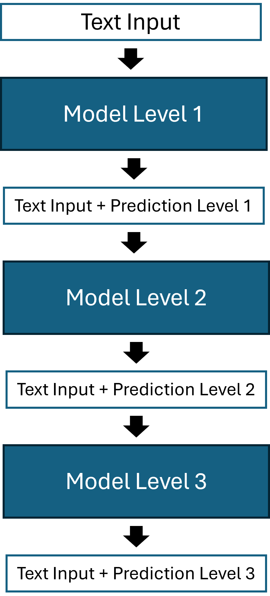
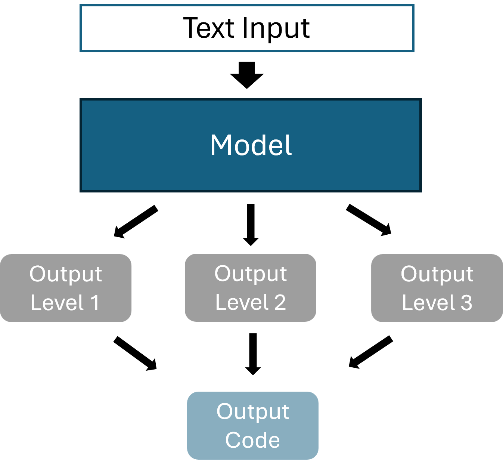

```{r,setup,echo=FALSE,message=FALSE}
library(ggplot2)
library(data.table)
library(openxlsx)
library(knitr)
```

# Case study

We train and evaluate models for NACE classification.
We use a subset of our available data to reduce training times.
A test set of 400 instances is used to evaluate the models.
The input texts of the test data is excluded from the training data, meaning that the test data does not contain any text used during training.

## Methods

We compare three different hierarchical approaches to flat classification.
The flat model ignores the hierarchy in the data of the dependent variable, and is used as a benchmark for the other models.
The three hierarchical approaches are:

-   Stacked Model
-   Multiple Outputs
-   Hierarchical Loss

We split NACE codes into three hierarchical levels: the first and second digit, the
third and fourth digit, and the fifth, the last, digit. We disregard the
letter as the very first item of the NACE codes for the classification
process, as these are unique in combination with the first two digits.

For implementing our models, we use R (version 4.4.3) with keras^[https://keras.io/] and
tensorflow^[https://tensorflow.rstudio.com/], accessed through reticulate^[https://cran.r-project.org/web/packages/reticulate/index.html].

### Stacked Model {#sec-stack}

The idea of the stacked model is training _one model per class level_ (aka one local classifier per level, LCL^["Hierarchical multilabel classification based on path evaluation", https://www.sciencedirect.com/science/article/pii/S0888613X15001073]),
resulting in three models. Supplementary to the input of the
first model (input text as token sequence and as one hot encoded
matrices), the second and third model are fed the probabilities for each
class derived from the previous model. The input to the second and third
model will therefore include the 85 and 86 predicted probabilities from
the first and second model respectively (85 different classes for the
first level, 86 for the second). By using multiple models to generate
one output code, we introduce the problem of generating invalid codes,
if we define the most likely code as the combination of all three most
likely level-codes (one code per model). To overcome this issue, we filter out all
invalid code combinations and only look at valid 5-digit codes. A more
in detail explanation is given in section [Top-k Codes for Models with
Outputs per Level]. The figure below illustrates the model architecture.

```{r, out.width='30%', fig.align='center', fig.cap='Stacked Model Architecture',include=T,echo=F}

```

### Multiple Outputs {#sec-multi}

The multiple output model receives the same input as the flat classifier, but will generate three outputs, one per hierarchy level (illustrated below).
In contrast to the stacked model, this approach only consists of a single model.
For each input, we hence get three output vectors, containing the class
probabilities for each output level. All three of these outputs need to
be concatenated into one valid output codes. This again, like for the
stacked model, poses the problem of generating invalid codes.
```{r, out.width='50%', fig.align='center', fig.cap='Multiple Outputs Model Architecture',include=T,echo=F}

```

### Hierarchical Loss {#sec-hl}

This model uses the same input, and produces the same output format as the flat classifier.
The difference is the alteration of the loss function.
While we use the cross-entropy for the flat classification, this model uses a hierarchical loss.
The hierarchical loss is based on weighted distances, and designed to assign different penalties (or distances) for misclassifications during training.
For a correct code, the penalty is zero.
The further away the predicted code from the true code, the higher the penalty.
These penalty values are set in a penalty matrix.
During training, the loss function collects the penalties for each predicted instance and computes the hierarchical loss with it.

Let $k=\{1,..,n\}$ denote all possible classes, our custom hierarchical loss is then defined as,

$$
loss=\sum_kp(k)*d(true,k),
$$

where $p(k)$ is the probability for class $k$, and $d(true,k)$ is the penalty for class $k$ given the true class,
according to the penalty matrix. This way, during training, the model will
learn to favor classes that are closer in distance to the true class to avoid high penalties.
We find that using only this custom loss leads to a decrease in performance, which is why we use the cross-entropy
in combination with our hiearchical loss function. The final loss
function we use for the model is a weighted combination of the
hierarchical loss and the standard cross-entropy loss. Specifically, 70%
of the total loss comes from the hierarchical penalty term and 30% from
the cross-entropy term. Formally, this is

$$
Loss=0.7*L_{hier}+0.3*L_{ce}.
$$

### Top-k Codes for Models with Outputs per Level

As mentioned in sections @sec-sec-stack and @sec-sec-multi, having
a model that produces codes for each level (level-codes) introduces two
problems: 1) the possibility of generating invalid codes, and 2) the
challenge of identifying top-k most probable codes. Our proposed
solution follows the below steps:

1.  For each level, identify the codes that have a probability higher
    than $\frac{1}{\# Codes}$, i.e. the codes with higher probability
    than random guessing. For example, in the case of NACE, for the
    third level (5th digit), there are six possible digits. In that
    case, we only select the codes with probability $\frac{1}{6}$ or
    higher.
2.  For the remaining codes of all levels, we multiply the probabilities
    for all code combinations and concatenate the respective level-codes
    to a 5-digit NACE code.
3.  Remove the invalid codes resulting from step 2 from the list of
    possible candidates.
4.  Sort the remaining codes by the computed product of probabilities in
    descending order.
5.  Only keep the top-k codes from the resulting list.

Note that excluding level-codes with probabilities lower than random
guessing, and removing invalid codes, introduces the possibility of the
list of most probable codes containing less than k codes. In that case,
we use the entire list of most probable codes generated by the steps
described above. A maximum of k codes can always be computed.

